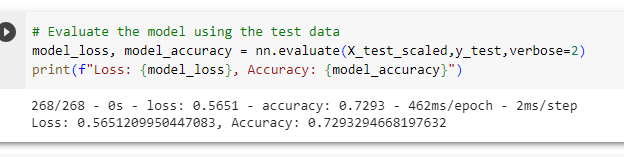
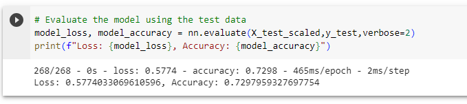
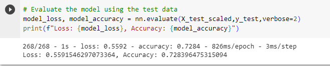

# deep-learning-challenge
Data Analytics Bootcamp: Module 21 Challenge

# Assignment
The nonprofit foundation Alphabet Soup wants a tool that can help it select the applicants for funding with the best chance of success in their ventures. With your knowledge of machine learning and neural networks, you’ll use the features in the provided dataset to create a binary classifier that can predict whether applicants will be successful if funded by Alphabet Soup.  From Alphabet Soup’s business team, you have received a CSV containing more than 34,000 organizations that have received funding from Alphabet Soup over the years.

# Instructions
* Step 1: Preprocess the Data
* Step 2: Compile, Train, and Evaluate the Model
* Step 3: Optimize the Model
* Step 4: Write a Report on the Neural Network Model (Below)

# Report
## Overview: 
The purpose of this analysis is to help the nonprofit foundation Alphabet Soup predict which funding applicants have the best chance of success in their ventures. The report analyzes data from over 34,000 organizations that have previously received funding from the foundation including their EIN and name, application type, affiliation, classification, use case, organization type, status, income amount, special considerations, ask amount, and success indicator of yes or no. A neural network model is created to predict success and then optimized to achieve a target predictive accuracy higher than 75%. 

## Results: 

### Data Preprocessing: 
The data was read into the script from the csv and preprocessed using the following steps: 
* Dropped the non-beneficial columns ("EIN" and "Name")
* Binned the data for "Application_Type" and "Classification_Type" 
* Used get_dummies to convert categorical variables into dummy variables
* The preprocessed data was then split into target and features. 
    * Target variable: "Is_Successful"
    * Features: "Status", "Ask_Amt", "Application_Type", "Income_Amt", and "Special_Considerations"
    * Dropped variables: "Affiliation", "Classification", "Use_Case", and "Organization"

### Compiling, Training, and Evaluating the Model:
A neural network was then created and optmized using google collab: 
* Attempt 1 (original model): 
    * Included two hidden layers with 80 neurons in the first hidden layer and 30 neurons in the second hidden layer. 
    * This attempt was not successful in achieving the target performance of 75%. The accuracy of this attempt was 72.87%. 
* Attempt 2:
    * For the second attempt, I added a third hidden layer with 20 neurons to the model. 
    * This attempt was also not successful in achieving the target performance, but came closer at 72.93% accuracy. 
* Attempt 3: 
    * For the third attempt, I doubled the neurons in each hidden layer. 
    * This attempt also did not achieve the target performance, but was the closest at 73% accuracy. 
* Attempt 4: 
    * I tried one last attempt where I kept the 3  hidden layers from attempt 2 but changed the activation function from "relu" to "tanh". 
    * This attempt gave an accuracy score of 72.8%.

## Summary: 
In summary, the deep learning model did not prove to be accurate enough for the foundation to use to effectively predict which funding applicants would be successful with funds. Changing the number of neurons, hidden layers, and activation types did not work to increase the accuracy to the achieved goal of 75% or more. My recommendation would be to try another classification model such as random forest or support vector machine. 